# WOORIDO 프로젝트 Gantt Chart

> **Demo Day**: 2026-02-25
> **전체 기간**: 57일 (8주)
> **작성일**: 2026-01-06
> **버전**: v1.0

---

## Gantt Chart (Mermaid 다이어그램)

### 전체 타임라인 (Phase별)

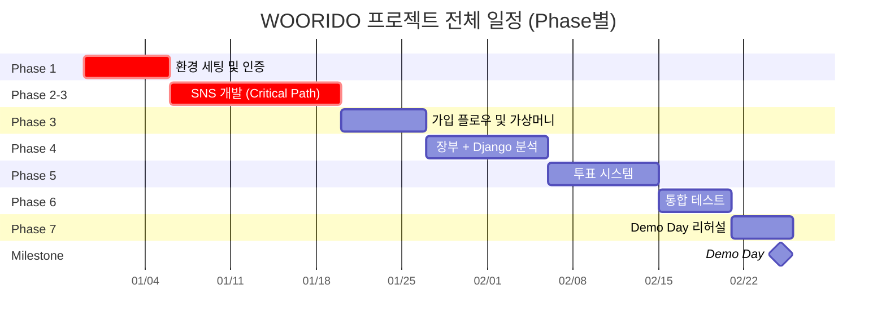

---

### Phase 1: 환경 세팅 (Week 1)

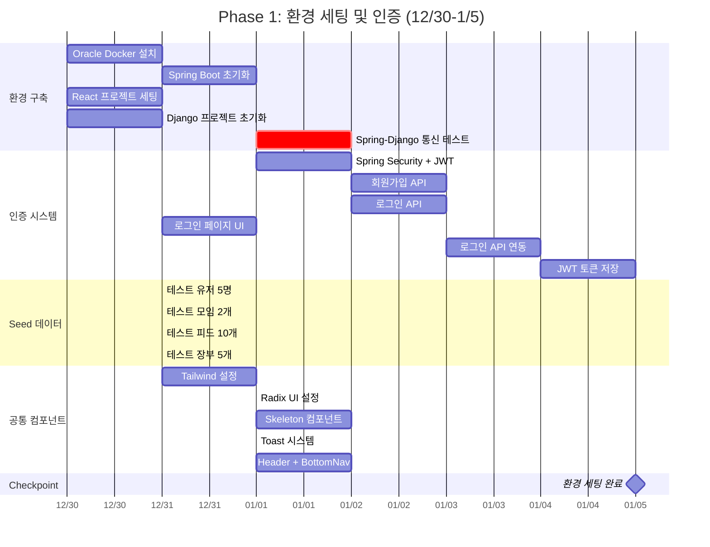

---

### Phase 2-3: SNS 개발 (Week 2-3) ⚠️ Critical Path

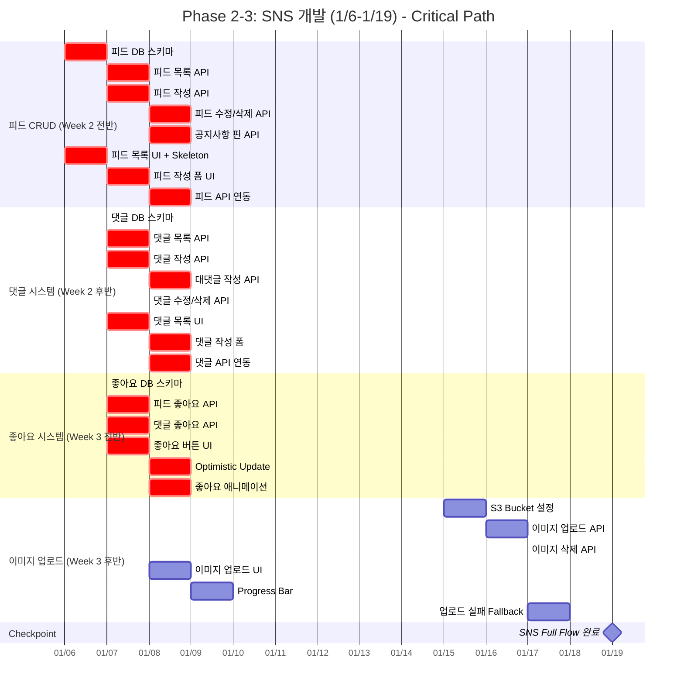

---

### Phase 3: 가입 플로우 (Week 4)

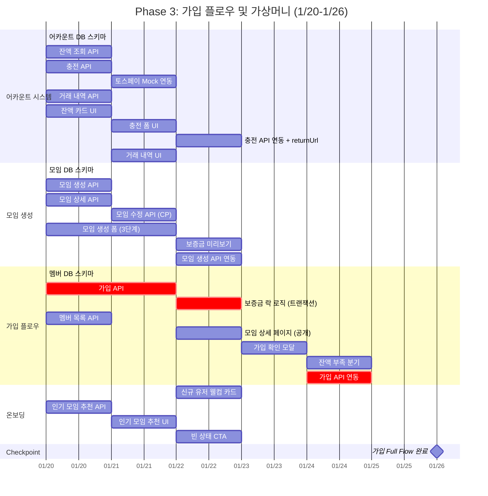

---

### Phase 4: 장부 + Django 분석 (Week 5)

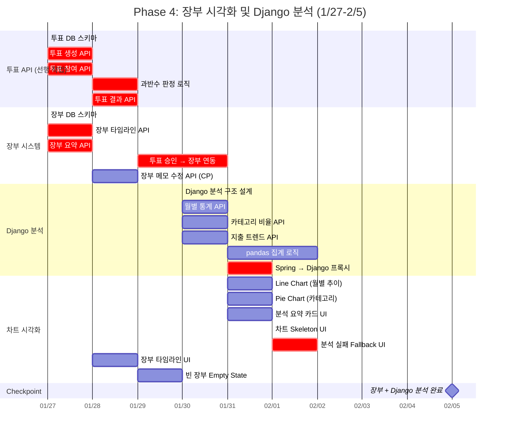

---

### Phase 5: 투표 시스템 (Week 6-7)

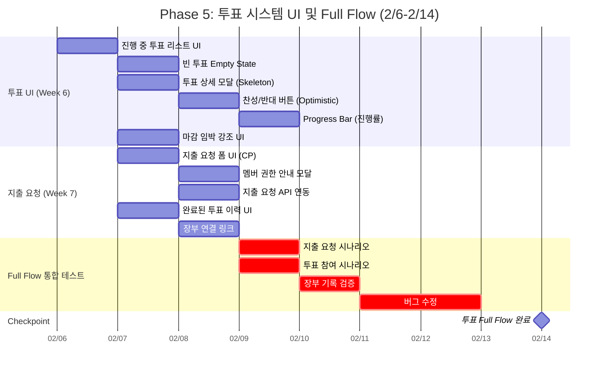

---

### Phase 6: 통합 테스트 (Week 8)

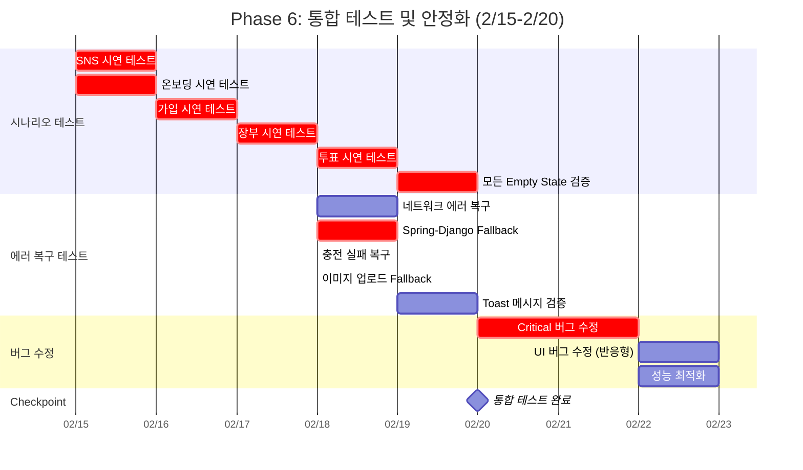

---

### Phase 7: Demo Day 리허설 (Week 9)

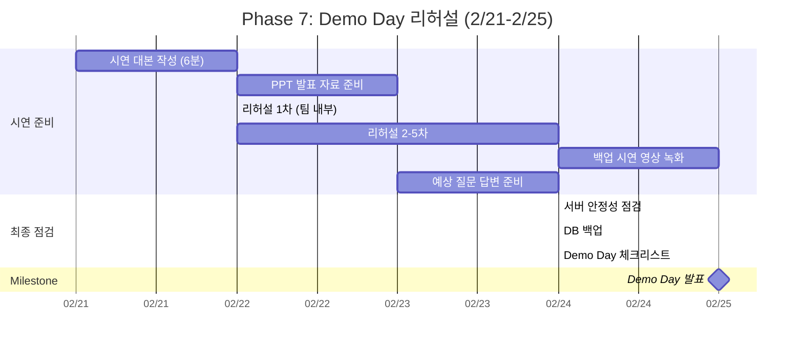

---

## Critical Path 시각화

### Critical Path 하이라이트

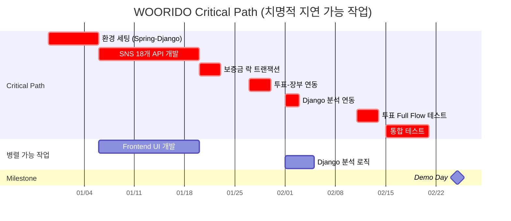

---

## 팀별 작업 타임라인

### Frontend Team

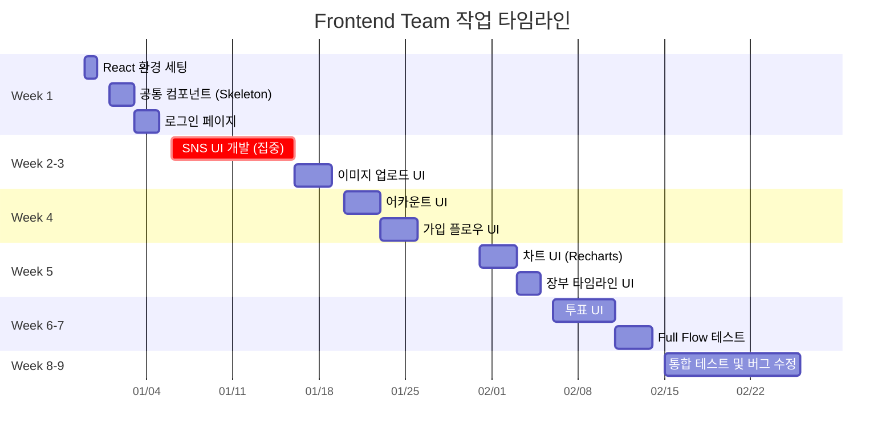

### Backend (Spring Boot) Team

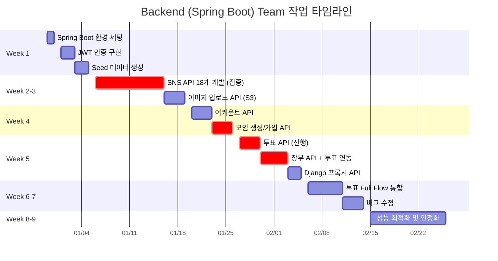

### Backend (Django) Team

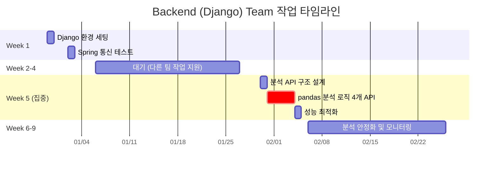

---

## 의존성 관계도

### API 의존성

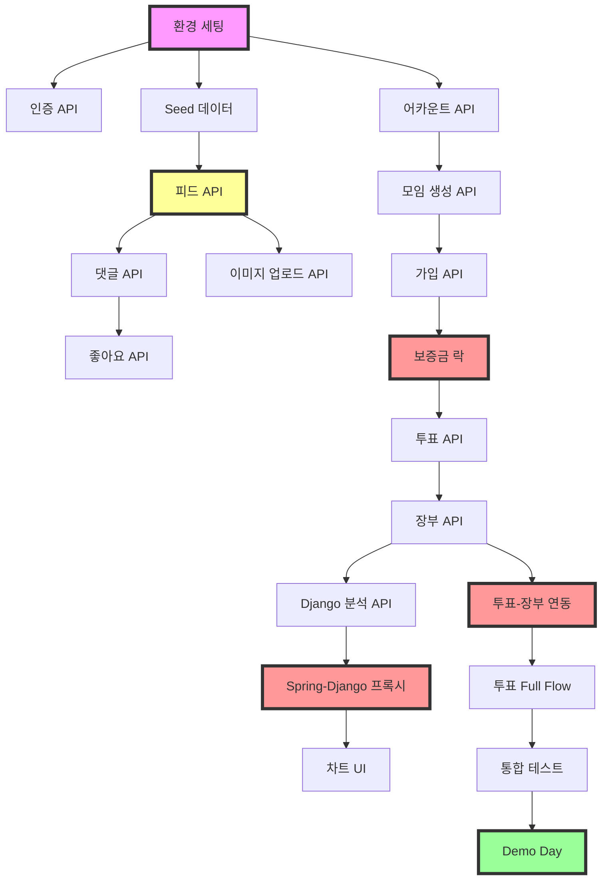

---

## 주간 진행률 목표

| Week | 날짜 | 목표 진척도 | 주요 Checkpoint |
|------|------|------------|----------------|
| Week 1 | 12/30-1/5 | 10% | 환경 세팅 완료, 로그인 가능 |
| Week 2 | 1/6-1/12 | 25% | 피드 + 댓글 API 완료 |
| Week 3 | 1/13-1/19 | 40% | SNS Full Flow 완료 |
| Week 4 | 1/20-1/26 | 55% | 가입 Full Flow 완료 |
| Week 5 | 1/27-2/5 | 70% | 장부 + Django 분석 완료 |
| Week 6 | 2/6-2/9 | 80% | 투표 UI 완료 |
| Week 7 | 2/10-2/14 | 85% | 투표 Full Flow 완료 |
| Week 8 | 2/15-2/20 | 95% | 통합 테스트 통과 |
| Week 9 | 2/21-2/25 | 100% | Demo Day 준비 완료 |

---

## 버퍼 타임 분포

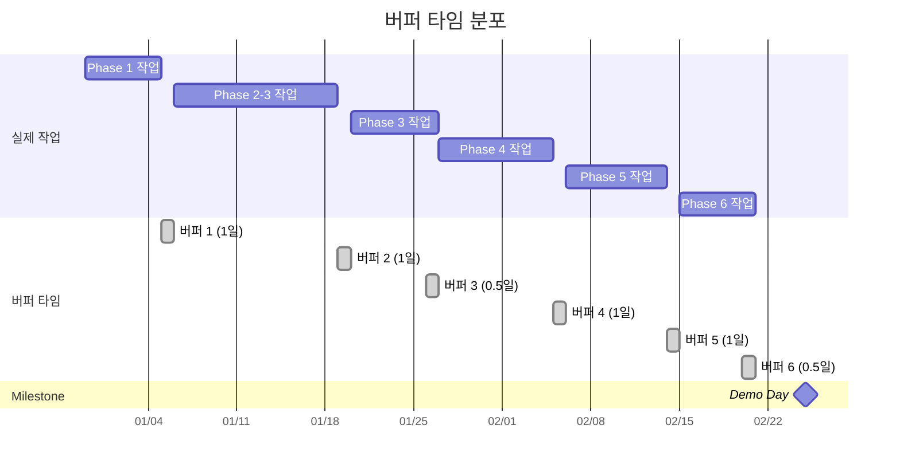

**총 버퍼 타임**: 5일 (전체 57일의 8.8%)

---

## 문서 버전 관리

| 날짜 | 버전 | 변경 내용 | 작성자 |
|------|------|----------|--------|
| 2026-01-06 | v1.0 | Gantt Chart 초안 작성 | PM Team |

---

## 관련 문서

- [WBS_MASTER.md](./WBS_MASTER.md) - WBS 마스터 문서
- [WBS_RISK_ANALYSIS.md](./WBS_RISK_ANALYSIS.md) - 리스크 분석
- [WEEKLY_REPORT_TEMPLATE.md](./WEEKLY_REPORT_TEMPLATE.md) - 주간 보고 양식

---

**이 Gantt Chart는 프로젝트 진행 상황에 따라 지속적으로 업데이트됩니다.**
